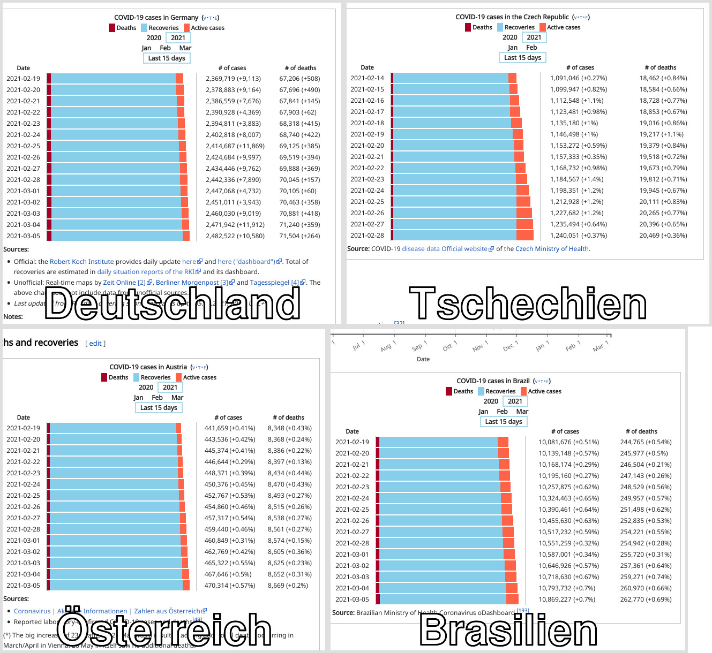

# coronagrafik-international

Vergleich von 4 Coronatabellen verschiedener Länder. Quelle sind die \<DIV\>s aus Wikipedia.
  Benötigt wird:
  
  1. Phantomjs
  2. Aus dem Paket imagemagick das Programm montage
  3. kopiere FreeSansBold.ttf nach /usr/share/fonts/truetype/freefont/   oder einem anderen Platz für verwendete Fonts.

 Alle 4 Ausschnitte werden zu einem Bild zuammengeführt

Viel Spass damit !
